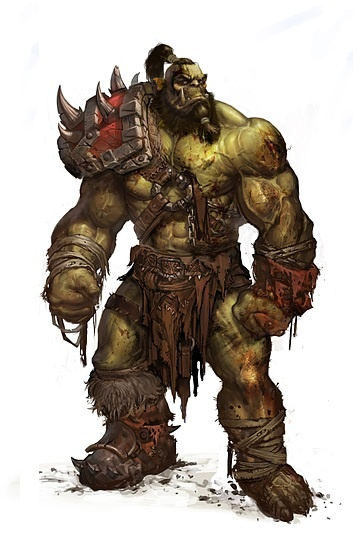

# Привет! Меня зовут Виталий:)

Это моя страничка-портфолио!

## Кто я

Начинающий разработчик. Учусь, экспериментирую и с удовольствием разбираюсь в  
новых технологиях.

## Чем занимаюсь

- Пытаюсь изучать Git, системы контроля версий и Java
- Осваиваю веб-разработку
- Люблю решать нетривиальные задачи, но от этого голова кипит

## Как меня найти

- GitHub: [manai516](https://github.com/manai516)
- Telegram:"будет добавлен позже"

